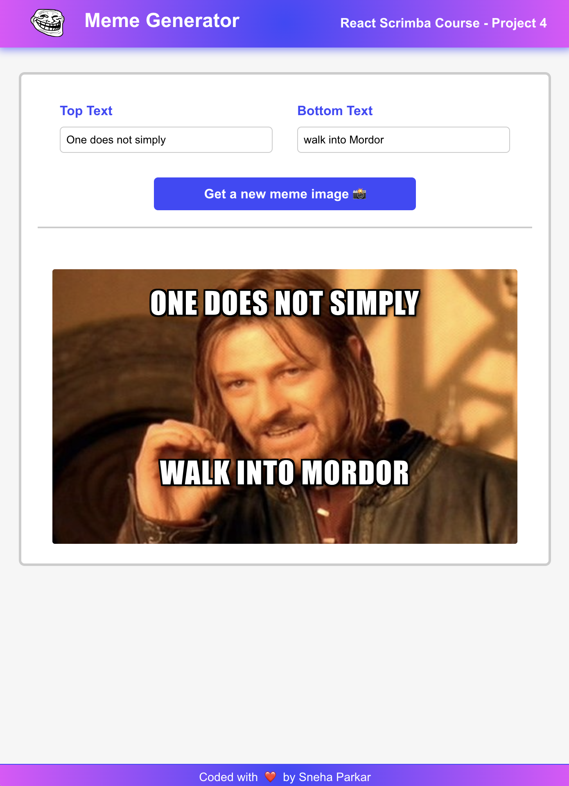

# Meme Generator (Scrimba React Course section 3 project)
This is a solution to the <a href="https://scrimba.com/learn/learnreact/">Meme Generator project on Scrimba.</a>

### Requirements
- Build a Meme Generator using React designed like this Figma file <a href="https://www.figma.com/file/MoLwFPHNHJVrzdFurxHzNV/Meme-Generator?type=design&node-id=0-1&mode=design&t=h0ZnLjYmu0Epj9Z9-0">Figma file</a>

- React Events
- useState
- Forms in React
- Conditional rendering
- Making API calls
- Side effects

### Screenshot

### Getting Started with Create React App

This project was bootstrapped with [Create React App](https://github.com/facebook/create-react-app).

## Available Scripts

If you want to see the final product, in the project directory, you can run:

## `npm start`

Runs the app in the development mode.\
Open [http://localhost:3000](http://localhost:3000) to view it in your browser.

### Built with

- Semantic HTML5 markup
- CSS custom properties
- React.JS
- Flexbox

## Author

- Website - [sneha parkar](https://snehaparkar.in)
